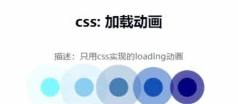

# css-border效果图 [查看示例](./css-border.html)

### 以上示例参考链接：https://juejin.cn/post/6918921604160290830#heading-2
# css-loading [查看示例](./loading-animation.html)

# css颜色选择器 [查看示例](./color-picker.html)

# css手风琴效果 [查看示例](./accordion.html)

### 以上示例参考链接：https://juejin.cn/post/6986967746453962782
